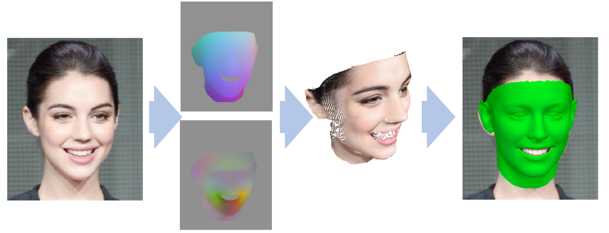

# pix2face
## The complete pix2face pipeline, including:
   * The pix2face dense face alignment and 3D estimation network ([pix2face_net](https://github.com/VisionSystemsInc/pix2face_net))
   * The camera/pose and face coefficient estimation contained in the [face3d](https://github.com/VisionSystemsInc/face3d) repository
   * Rendering of novel viewpoints and expressions


## Requirements
You have two options for running: within a docker container, or natively on your system. The only requirement for the former is docker itself.  The requirements for building and running natively are:

   * CMake (version 3.10 or higher)
   * Python (version 3.6 has been tested)
   * numpy, Pillow, scikit-image
   * pytorch (version 0.4 has been tested), including torchvision
   * opencv (opencv-python-headless)

Optional:

   * CUDA (for GPU acceleration of pix2face network and coefficient estimation)

For a full list of system packages required, consult the [Dockerfile](./docker/Dockerfile).

## Setup and Running (Docker)
See the [README.md](./docker/README.md) in the docker directory of this repository.


## Setup (Native)
Clone this repository to `$PIX2FACE_SRC_DIR`. If you did not clone recursively, you'll need to run:
```bash
cd $PIX2FACE_SRC_DIR
git submodule update --init --recursive --progress
```

Create a build directory and run Cmake:
```bash
mkdir $PIX2FACE_BUILD_DIR
cd $PIX2FACE_BUILD_DIR
cmake $PIX2FACE_SRC_DIR
```

Note: Depending on the location of your graphics libraries, you may have to set CMAKE_PREFIX_PATH. For example:
```bash
cmake -DCMAKE_PREFIX_PATH=/usr/lib64/nvidia $PIX2FACE_SRC_DIR
```

By default, the compiled python modules will be installed in the active python site.  If you want to change this, add `-DPYTHON_SITE=${INSTALL_DIR}` to the cmake command line and add `${INSTALL_DIR}` to your `PYTHONPATH`.


Build the face3d and vxl compiled python modules:

```bash
make install
```

Configure your python path:
Make sure to set the environment variable `PIX2FACE_BUILD_DIR`, and then source the env script:
```bash
cd $PIX2FACE_SRC_DIR
source ./pix2face_env.bsh
```

Or, manually:

```bash
export PYTHONPATH=${PIX2FACE_SRC_DIR}/pix2face:${PIX2FACE_SRC_DIR}/python
```

Download the required data files to their correct locations by running the `download_data.bsh` script:
```bash
cd ${PIX2FACE_SRC_DIR}
./download_data.bsh
```


## Running (Native)
To exercise the full pipeline, you can run the demo script:
```bash
python scripts/pix2face_demo.py
```
This will estimate face geometry and render images with new pose and expression in the scripts directory.


The scripts directory also contains several examples of pose and coefficient estimation. For example, to generate a CSV file `$POSE_CSV_FNAME` with yaw, pitch, and roll (in degrees) of every face image listed (one per line) in the text file `$IMAGE_PATHS_FILE`:
``` bash
python scripts/estimate_pose_batch.py $IMAGE_PATHS_FILE $POSE_CSV_FNAME
```

Note that the examples in the [scripts](./scripts) directory generally set a variable `cuda_device`, which is defaulted to `None`.  The value of `None` will cause the pix2face network to run on the CPU.  Set `cuda_device` to an integer value to run on the corresponding GPU device for increased processing speed.


## Citation
If you find this software useful, please consider referencing:

```bibtex
@INPROCEEDINGS{pix2face2017,
author = {Daniel Crispell and Maxim Bazik},
booktitle = {2017 IEEE International Conference on Computer Vision Workshop (ICCVW)},
title = {Pix2Face: Direct 3D Face Model Estimation},
year = {2017},
pages = {2512-2518},
ISSN = {2473-9944},
month={Oct.}
}
```


## Contact
Daniel Crispell [dan@visionsystemsinc.com](mailto:dan@visionsystemsinc.com)
